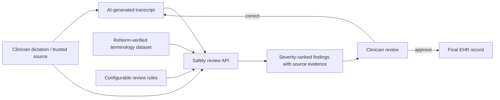

# System design

## Current local implementation

The Node server accepts a candidate transcript and an optional source transcript. It loads verified medication terms from `dataset/processed/mtsamples_with_rxnorm.json` at startup, applies the configurable rules, and returns JSON findings to the dashboard.

## AWS target design

1. An approved application uploads a transcript pair or batch JSON to an encrypted S3 bucket.
2. An S3 event invokes the Lambda ingestion function.
3. The Lambda invokes the review service and stores findings in DynamoDB or an S3 results prefix.
4. CloudWatch captures operational logs without storing unnecessary PHI.
5. The review UI presents evidence to an authorised clinician; only an explicit approval can write to the EHR integration boundary.

The repository currently includes the ingestion Lambda starter. Cloud deployment is intentionally not executed with real medical records in this student prototype.
